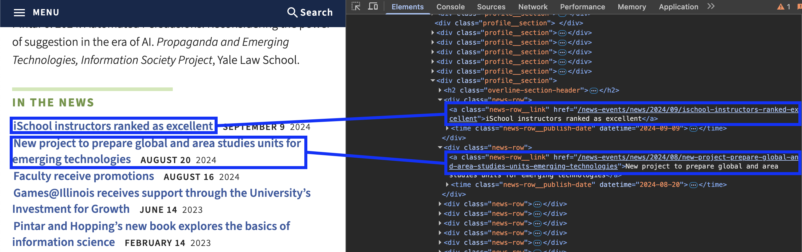

..  shortname:: Explaining
..  description:: Explaining activity.

.. setup for automatic question numbering.

.. qnum::
   :start: 1
   :prefix: explaining-

Code explaining activity
:::::::::::::::::::::::::

Look at the code below, and try to determine what it does. Describe the code in your own words.

Relevant tags
**********************

Here's the relevant tag from ``https://ischool.illinois.edu/people/judith-pintar``:

.. raw:: html

  <a href="/ns/books/published/cs102web/plan1.html"><pre style="background-color:#FCF3CF;">
  <strong># Load libraries for web scraping</strong>
  from bs4 import BeautifulSoup
  import requests
  <strong># Get a soup from <mark>a URL</mark></strong>
  url = <mark>'https://www.info.univ.edu/people/jane-doe'</mark>
  r = requests.get(url)
  soup = BeautifulSoup(r.content, 'html.parser')</pre></a>
  <a href="/ns/books/published/cs102web/plan3.html"><pre style="background-color:#D5F5E3;">
  <strong># Get all tags of <mark>a certain type</mark> from the soup</strong>
  tags = soup.find_all(<mark>'a', class_='item-teaser--more'</mark>)
  <strong># Collect info from the tags</strong>
  collect_info = []
  for tag in tags:
      <strong># Get <mark>info</mark> from tag</strong>
      info = tag.<mark>get('href')</mark>
      collect_info.append(info)</pre></a>
  <a href="/ns/books/published/cs102web/plan2.html"><pre style="background-color:#FDEBD0;">
  <strong># Get a soup from multiple URLs</strong>
  base_url = <mark>'https://www.info.univ.edu/'</mark>
  endings = <mark>collect_info</mark>
  for ending in endings:
       url = base_url + ending
       r = requests.get(url)
       soup = BeautifulSoup(r.content, 'html.parser')</pre></a>
       <a href="/ns/books/published/cs102web/plan3.html"><pre style="background-color:#D5F5E3;">
       <strong># Get all tags of <mark>a certain type</mark> from the soup</strong>
       tags = soup.find_all(<mark>'p'</mark>)
       # Collect info from the tags
       collect_info = []
       for tag in tags:
           <strong># Get <mark>info</mark> from tag</strong>
           info = tag.<mark>text</mark>
           collect_info.append(info)</pre></a>
           <a href="/ns/books/published/cs102web/plan5.html"><pre style="background-color:#D6EAF8;">
           <strong># Print the <mark>info</mark></strong>
           print(<mark>collect_info</mark>)</pre></a>
            
.. shortanswer:: explain_answer

   Write down your best guess of what the code does.

.. sidebar:: Links to plans

    |plan_1|

    |plan_2|

    |plan_3|

    |plan_4|

    |plan_5|

    .. |plan_1| raw:: html

        <a href="/ns/books/published/cs102web/plan1.html" target="_blank">Plan 1: Get a soup from a URL</a>

    .. |plan_2| raw:: html

        <a href="/ns/books/published/cs102web/plan2.html" target="_blank">Plan 2: Get a soup from multiple URLs</a> 

    .. |plan_3| raw:: html

        <a href="/ns/books/published/cs102web/plan3.html" target="_blank">Plan 3: Get info from all tags of a certain type</a> 

    .. |plan_4| raw:: html

        <a href="/ns/books/published/cs102web/plan4.html" target="_blank">Plan 4: Get info from a single tag</a>
   
    .. |plan_5| raw:: html

        <a href="/ns/books/published/cs102web/plan5.html" target="_blank">Plan 5: Print info</a> 

.. reveal:: explain_run_code
    :showtitle: If you need a hint, click here.

     You can run the code below and see what happens.

    .. activecode:: explain_code
        :language: python3
        :nocodelens:

        #Get the webpage
        # Load libraries for web scraping
        from bs4 import BeautifulSoup
        import requests
        # Get a soup from a URL 
        url = 'https://ischool.illinois.edu/people/judith-pintar'
        r = requests.get(url)
        soup = BeautifulSoup(r.content, 'html.parser')

        #Extract info from the webpage
        # Get all tags of a certain type from the soup
        tags = soup.find_all('a', class_='news-row__link')
        # Collect info from the tags
        collect_info = []
        for tag in tags:
          # Get link from tag
          info = tag.get('href')
          collect_info.append(info)

        #Do something with the info
        # Get a soup from multiple URLs 
        base_url = 'https://ischool.illinois.edu/'
        endings = collect_info
        for ending in endings:
            url = base_url + ending 
            r = requests.get(url) 
            soup = BeautifulSoup(r.content, 'html.parser')

            # Get all tags of a certain type from the soup
            tags = soup.find_all('p')
            # Collect info from the tags
            collect_info = []
            for tag in tags:
                # Get text from tag
                info = tag.text
                collect_info.append(info)
            
            # Print the info
            print(collect_info)