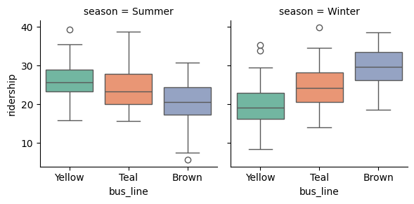

..  Copyright (C)  Brad Miller, David Ranum, Jeffrey Elkner, Peter Wentworth, Allen B. Downey, Chris
    Meyers, and Dario Mitchell.  Permission is granted to copy, distribute
    and/or modify this document under the terms of the GNU Free Documentation
    License, Version 1.3 or any later version published by the Free Software
    Foundation; with Invariant Sections being Forward, Prefaces, and
    Contributor List, no Front-Cover Texts, and no Back-Cover Texts.  A copy of
    the license is included in the section entitled "GNU Free Documentation
    License".

..  shortname:: Exercises
..  description:: Seaborn Exercises

.. setup for automatic question numbering.

.. qnum::
   :start: 1
   :prefix: ex1-
   

Exercises
###########################################

.. highlightedtextbox::
   :title:
   :color: #f4e36e
   :highlight-color: #ff9b3e
   :highlight-on-load:
   
   These exercises provide some practice for the concepts we have covered so far. If you need to go back to the previous examples and look up a definition, use the arrow at the bottom left to go back, or click <a href="/index.html">HERE</a> to go back to the table of contents.

.. image:: _static/weather-box.png
    :scale: 90%
    :align: center
    :alt: A plot example

.. parsonsprob:: parsons_box
   
   Look at the plot provided above. What code could produce that? Drag and drop the lines of code from below in the correct order to achieve that plot. You will not use all of the blocks.
   
   -----
   import seaborn as sns
   =====
   weather = load_dataset("weather")
   =====
   figure = sns.boxplot(x="year", y="temperature_average", data=weather)
   =====
   figure = sns.barplot(x="year", y="temperature_average", data=weather)#distractor
   =====
   figure = sns.FacetGrid(x="month", y="temperature_average", data=weather)#distractor
   =====
   figure = weather.map(sns.boxplot, x="year", y="temperature_average")#distractor
   =====
   figure = sns.boxplot(x="month", y="temperature_average", data=weather)#distractor
   =====
   figure = sns.barplot(x="temperature_average", y="month", data=weather)#distractor
   =====
   figure = sns.FacetGrid(x="temperature_average", y="year", data=weather)#distractor
   =====
   figure = weather.map(sns.barplot, x="year", y="temperature_average")#distractor
   =====
   display(figure)
   

.. mchoice:: box_plot_scenarios
   :answer_a: sns.boxplot(data=libraries, x="month", y="attendance")
   :feedback_a: This would show which months have more variance across libraries, but not which libraries have more variance across months.
   :answer_b: sns.boxplot(data=libraries, x="library", y="attendance")
   :feedback_b: Correct!
   :answer_c: sns.barplot(data=libraries, x="library", y="attendance")
   :feedback_c: No, a box plot would be more appropriate for this.
   :answer_d: sns.barplot(data=libraries, x="month", y="attendance")
   :feedback_d: No, a box plot would be more appropriate for this.
   :correct: b

   You are given a dataset that shows the average number of people who studied at each library on campus for each month in 2025. You want to see what libraries experience major changes in occupancy throughout the year. What line of code would be the most useful for visualizing this?

.. mchoice:: bar_plot_scenarios
   :answer_a: Finding out the movies that were seen by the most people
   :feedback_a: Correct! Bar plots can show use the total number.
   :answer_b: Finding out the movies that were the most divisive in terms of audience ratings
   :feedback_b: No, a box plot would be more appropriate for this since we need to see the distribution of audience ratings.
   :answer_c: Comparing the relation between the rating of a movie and the number of people who have seen it
   :feedback_c: No, other plot types (such as a scatterplot) would be more appropriate for this.
   :correct: a

   Assume that you can obtain a large dataset from a movie theater chain. What of the following problems would be best addressed with a bar plot?

.. fillintheblank:: fill-box

   Fill in the blanks in the following code piece to plot the distribution of "sales" for each different "store". 
   `sns.` |blank| ``(x = " `` |blank| ``", y = "`` |blank| ``", data=dataset)``

    -   :boxplot:  Correct!
        :barplot:  Incorrect: Since we are plotting the distribution, try 'barplot'.
        :.*:    Incorrect: What type of plot could we use to plot distributions? Check the earlier example if you need a hint!
    -   :store:  Correct!
        :"store":  Almost correct! Note that we already have quotes around the blank space, so you do not need to put "store" into quotes.
        :"stores": Almost correct! In this example, the variable name is "store", not "stores."
        :stores: Almost correct! In this example, the variable name is "store", not "stores."
        :x:  Incorrect: x-axis is our horizontal axis, and we want to have different categories we want to compare here. For instance, we are comparing different "stores" in this problem.
    -   :sales:  Correct!
        :"sales":  Almost correct! Note that we already have quotes around the blank space, so you do not need to put "sales" into quotes.
        :x:  Incorrect: y-axis is our horizontal axis, and we want to have variable that we are interested in the distribution of. For instance, we are interested in the distribution of "sales" in this problem.

.. fillintheblank:: fitb_box
   :code_template:
      import seaborn as sns
      dataset = load_dataset('sales_data')
      figure = sns.@@blank1@@(x = "@@blank2@@", y = "@@blank3@@", data=dataset)
      display(figure)
   :correct: ["boxplot", "store", "sales"]
   :feedback: ["The first box is incorrect. What type of plot could we use to plot distributions? Check the earlier example if you need a hint!", "The second box is incorrect. x-axis is our horizontal axis, and we want to have different categories we want to compare here. For instance, we are comparing different 'stores' in this problem.", "The third box is incorrect. y-axis is our horizontal axis, and we want to have variable that we are interested in the distribution of. For instance, we are interested in the distribution of 'sales' in this problem."]
   :placeholder: ["", "", ""]

   Fill in the blanks in the following code piece to plot the distribution of "sales" for each different "store".

.. fillintheblank:: fitb_grid
   :code_template:
      import seaborn as sns
      dataset = load_dataset("bus_data")
      grid = sns.FacetGrid(dataset, col='@@blank1@@', sharey=False)
      grid.map(@@blank2@@, '@@blank3@@', '@@blank4@@', palette='Set2', errorbar=None)
      display(grid)
   :correct: ["season", "sns.boxplot", "bus_line", "ridership"]
   :feedback: ["The first box is incorrect. This box represents the variable that we use to split the data and create the grid. In this example, we split our data as Summer and Winter. Which column could represent that?", "The second box is incorrect. This should be a Seaborn plotting function, such as sns.boxplot or sns.barplot.", "The third box is incorrect. x-axis is our horizontal axis. What column of the data is plotted on the horizontal axis?", "The fourth box is incorrect. y-axis is our vertical axis. What column of the data is plotted on the vertical axis?"]
   :placeholder: ["", "", "x", "y"]

   Look at the plot above the question, which represents the distribution of the number of bus riders on three different lines for summer and winter. What code could have generated that? The dataset has three columns: "bus_line", "ridership", and "season". Using this information, fill in the blanks below to complete the code.
   

.. mchoice:: rotation_question
   :answer_a: figure.tick_params(axis='x', labelrotation=45)
   :feedback_a: Correct!
   :answer_b: figure.tick_params(axis='y', labelrotation=45)
   :feedback_b: No, this would rotate the labels on the vertical axis (y-axis).
   :answer_c: figure.set_xlabel(45)
   :feedback_c: No, this would set the label for the x-axis to "45", but it would not rotate the labels.
   :answer_d: figure.tick_params(axis='x', labelrotation=45)
   :feedback_d: No, this would rotate the labels so that they would seem as vertical.
   :correct: b

   How would you rotate the labels on the horizontal axis diagonally (e.g. similar to the image below)?

   .. image:: _static/diagonal-label.png
      :scale: 45%
      :align: left
      :alt: An x-axis with diagonal labels.
    

.. highlightedtextbox::
   :title:
   :color: #f4e36e
   :highlight-color: #ff883e
   :highlight-on-load:
   
   If you are done with the exercises, click on the arrow on the bottom right to move to the last page of this tutorial!