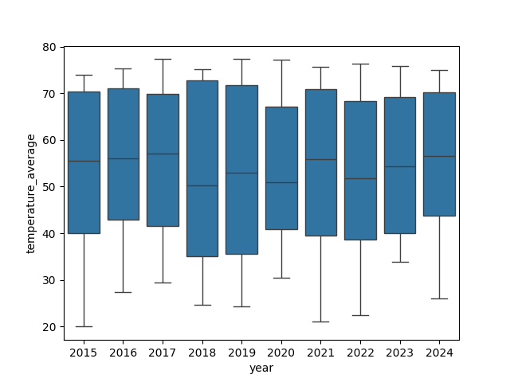

..  Copyright (C)  Brad Miller, David Ranum, Jeffrey Elkner, Peter Wentworth, Allen B. Downey, Chris
    Meyers, and Dario Mitchell.  Permission is granted to copy, distribute
    and/or modify this document under the terms of the GNU Free Documentation
    License, Version 1.3 or any later version published by the Free Software
    Foundation; with Invariant Sections being Forward, Prefaces, and
    Contributor List, no Front-Cover Texts, and no Back-Cover Texts.  A copy of
    the license is included in the section entitled "GNU Free Documentation
    License".

..  shortname:: Exercises
..  description:: Seaborn Exercises

.. setup for automatic question numbering.

.. qnum::
   :start: 1
   :prefix: ex1-
   

Exercises
###########################################

.. parsonsprob:: parsons_box
   
   Look at the plot provided above. What code could produce that? Drag and drop the lines of code from below in the correct order to achieve that plot. You will not use all of the blocks.
   
   -----
   import seaborn as sns
   =====
   weather = load_dataset("weather")
   =====
   figure = sns.boxplot(x="year", y="temperature_average", data=weather)
   =====
   figure = sns.barplot(x="year", y="temperature_average", data=weather)#distractor
   =====
   figure = sns.FacetGrid(x="month", y="temperature_average", data=weather)#distractor
   =====
   figure = weather.map(sns.boxplot, x="year", y="temperature_average")#distractor
   =====
   figure = sns.boxplot(x="month", y="temperature_average", data=weather)#distractor
   =====
   figure = sns.barplot(x="temperature_average", y="month", data=weather)#distractor
   =====
   figure = sns.FacetGrid(x="temperature_average", y="year", data=weather)#distractor
   =====
   figure = weather.map(sns.barplot, x="year", y="temperature_average")#distractor
   =====
   display(figure)
   

.. mchoice:: box_plot_scenarios
   :answer_a: sns.boxplot(data=libraries, x="month", y="attendance")
   :feedback_a: This would show which months have more variance across libraries, but not which libraries have more variance across months.
   :answer_b: sns.boxplot(data=libraries, x="library", y="attendance")
   :feedback_b: Correct!
   :answer_c: sns.barplot(data=libraries, x="library", y="attendance")
   :feedback_c: No, a box plot would be more appropriate for this.
   :answer_d: sns.barplot(data=libraries, x="month", y="attendance")
   :feedback_d: No, a box plot would be more appropriate for this.
   :correct: b

   You are given a dataset that shows the average number of people who studied at each library on campus for each month in 2025. You want to see what libraries experience major changes in occupancy throughout the year. What line of code would be the most useful for visualizing this?

.. mchoice:: bar_plot_scenarios
   :answer_a: Finding out the movies that were seen by the most people
   :feedback_a: Correct!
   :answer_b: Finding out the movies that were the most divisive in terms of audience ratings
   :feedback_b: No, a box plot would be more appropriate for this.
   :answer_c: Comparing the relation between the rating of a movie and the number of people who have seen it
   :feedback_c: No, other plot types (such as a scatterplot) would be more appropriate for this.
   :correct: a

   Assume that you can obtain a large dataset from a movie theater chain. What of the following problems would be best addressed with a bar plot?

