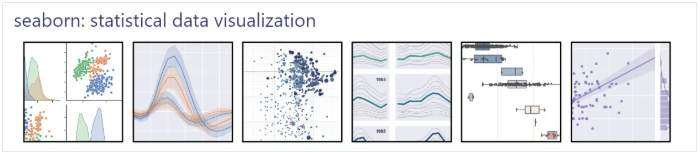

..  Copyright (C)  Brad Miller, David Ranum
    Permission is granted to copy, distribute and/or modify this document
    under the terms of the GNU Free Documentation License, Version 1.3 or
    any later version published by the Free Software Foundation; with
    Invariant Sections being Forward, Prefaces, and Contributor List,
    no Front-Cover Texts, and no Back-Cover Texts.  A copy of the license
    is included in the section entitled "GNU Free Documentation License".

=================================================
Introduction to Data Visualization with Seaborn
=================================================

Visualization libraries in Python enable users to create intuitive and interactive data visualizations that can effectively communicate insights to a broad audience. Some of the popular visualization libraries and frameworks in Python include Matplotlib, Plotly, Bokeh, and Seaborn. Each of these libraries has its own unique features and capabilities that cater to specific needs. 

In this tutorial, we will focus on Seaborn, a popular data visualization library in Python that offers an easy-to-use interface for creating informative statistical graphics.

What is Seaborn?
:::::::::::::::::::::
 
Built on top of Matplotlib, Seaborn is a well-known Python library for data visualization that offers a user-friendly interface for producing visually appealing and informative statistical graphics. It is designed to work with Pandas dataframes, making it easy to visualize and explore data quickly and effectively.

Seaborn offers a variety of powerful tools for visualizing data, including scatter plots, line plots, bar plots, heat maps, and many more. It also provides support for advanced statistical analysis, such as regression analysis, distribution plots, and categorical plots.

Seaborn's key benefit lies in its capability to generate attractive plots with minimal coding efforts. It provides a range of default themes and color palettes, which you can easily customize to suit your preferences. Additionally, Seaborn offers a range of built-in statistical functions, allowing users to easily perform complex statistical analysis with their visualizations.

Another notable feature of Seaborn is its ability to create complex multi-plot visualizations. With Seaborn, users can create grids of plots that allow for easy comparison between multiple variables or subsets of data. This makes it an ideal tool for exploratory data analysis and presentation.

How this ebook works
::::::::::::::::::::

.. admonition:: This tutorial is the first part of today's lab activity.
   
   This is similar to an online tutorial you could find online. We expect you to spend 30-45 minutes reading all the pages included in this tutorial, which cover important Seaborn concepts. On most pages, there will be code examples that you can run to create a figure. We also provide some exercises at the end, so that you can practice what you have learned.

   After finishing this tutorial, you will move to the second part of today's lab, which will be a short, ungraded quiz where you can show what you will learn in the tutorial! 

   This is an individual activity, but if you encounter any technical problems, please let the course staff know!

Table of Contents
::::::::::::::::::::::::::::::::::::::

.. toctree::
   :maxdepth: 2

   ct-comparison.rst
   ct-dataset.rst
   ct-types.rst
   ct-box.rst
   ct-bar.rst
   ct-grid.rst
   ct-customization.rst

Putting it together
::::::::::::::::::::::::::::::::::::::

.. toctree::
   :maxdepth: 1

   ct-exercise.rst
   final.rst

.. highlightedtextbox::
   :title:
   :color: #f4e36e
   :highlight-color: #ffe53e
   :highlight-on-load:
   
   Click on the arrow on the bottom right to start from the first page.
